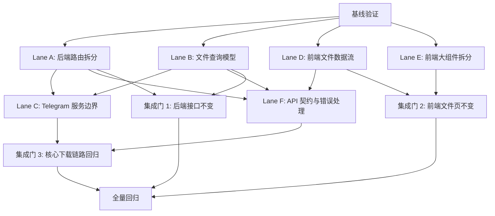

# Telegram Files Parallel System Refactor Implementation Plan

> **For agentic workers:** REQUIRED SUB-SKILL: Use superpowers:subagent-driven-development (recommended) or superpowers:executing-plans to implement this plan task-by-task. Steps use checkbox (`- [ ]`) syntax for tracking.

**Goal:** 在不改变现有用户可见行为的前提下，分阶段重构 `telegram-files` 的后端路由、文件查询、Telegram 业务边界、前端文件页状态和接口契约，并让多个执行线程/代理可以安全并行推进。

**Architecture:** 本计划采用“先建保护网、再拆边界、最后收敛契约”的路线。每个并行流只拥有明确文件集合，跨流共享点通过接口冻结、短期适配层和阶段性集成门控制，避免多个线程同时修改同一个核心类。核心下载链路、数据库迁移和 TDLib 状态机默认串行保护，只有补足测试后才允许进入重构。

**Tech Stack:** Java 23, Vert.x 5, Gradle, JUnit 5, Mockito, Next.js 16 App Router, React 19, TypeScript 5, SWR, ESLint, Prettier

---

## 0. 执行原则

这是一份面向多线程/多代理执行的重构计划，不是一次性大改方案。每个任务都应保持行为兼容、提交粒度小、可独立回滚。

- 所有执行线程开始前必须先跑基线检查：`api/gradlew.bat test`、`web/npm run check`。如果基线失败，先记录失败项，不能把原有失败归因到重构任务。
- 每个执行线程只修改自己任务声明的文件。若必须跨边界修改，先在共享记录区登记并等待协调。
- 每个任务完成后必须运行该任务列出的局部验证；阶段合并前再运行全量验证。
- 同一时刻只能有一个线程修改这些串行保护文件：`api/src/main/java/telegram/files/TelegramVerticle.java`、`api/src/main/java/telegram/files/DataVerticle.java`、`api/src/main/java/telegram/files/repository/FileRecord.java`、数据库定义/迁移相关文件。
- 外部行为必须保持兼容：HTTP 路径、请求参数、响应字段、WebSocket 消息类型、下载/暂停/删除语义不主动改变。

## 1. 并行拓扑

| 执行流 | 可并行性 | 主要目标 | 默认负责人 | 主要文件范围 |
| --- | --- | --- | --- | --- |
| Lane A | 可独立启动 | 后端路由拆分和 HTTP 外壳瘦身 | 后端线程 A | `api/src/main/java/telegram/files/HttpVerticle.java`, 新增 `api/src/main/java/telegram/files/http/**` |
| Lane B | 可独立启动 | 文件查询模型、排序和筛选白名单 | 后端线程 B | `api/src/main/java/telegram/files/repository/impl/FileRepositoryImpl.java`, 新增 `api/src/main/java/telegram/files/repository/query/**` |
| Lane C | 等 A/B 接口稳定后启动 | Telegram 业务服务边界拆分 | 后端线程 C | `api/src/main/java/telegram/files/TelegramVerticle.java`, 新增 `api/src/main/java/telegram/files/telegram/**` |
| Lane D | 可独立启动 | 前端文件页数据流拆分 | 前端线程 D | `web/src/hooks/use-files.ts`, 新增 `web/src/hooks/files/**` |
| Lane E | 可独立启动 | 前端大组件拆分 | 前端线程 E | `web/src/components/automation-form.tsx`, `file-video.tsx`, `file-filters.tsx`, 新增对应子组件目录 |
| Lane F | 等 A/B/D 初版后启动 | API 类型契约和统一错误处理 | 全栈线程 F | `web/src/lib/api.ts`, `web/src/lib/types.ts`, 新增 `api/src/main/java/telegram/files/http/ApiError.java` |
| Lane G | 全程穿插 | 测试、回归脚本和质量门 | 测试线程 G | `api/src/test/**`, 可新增 `docs/refactor/**` |

## 2. 依赖图



## 3. 共享接口冻结清单

这些接口在重构期间不得改变路径、字段和状态码，除非单独开兼容性任务。

| 类型 | 冻结内容 |
| --- | --- |
| HTTP 基础 | `GET /`, `GET /health`, `GET /version`, `GET /settings`, `POST /settings/create` |
| Telegram 账号 | `POST /telegram/create`, `POST /telegram/:telegramId/delete`, `GET /telegrams`, `POST /telegrams/change` |
| Telegram 聊天 | `GET /telegram/:telegramId/chats`, `GET /telegram/:telegramId/chat/:chatId/files`, `GET /telegram/:telegramId/chat/:chatId/files/count` |
| 文件操作 | `GET /:telegramId/file/:uniqueId`, `POST /:telegramId/file/start-download`, `POST /:telegramId/file/cancel-download`, `POST /:telegramId/file/toggle-pause-download`, `POST /:telegramId/file/remove` |
| 批量文件 | `GET /files`, `GET /files/count`, `POST /files/start-download-multiple`, `POST /files/cancel-download-multiple`, `POST /files/toggle-pause-download-multiple`, `POST /files/remove-multiple`, `POST /files/update-tags` |
| WebSocket | `/ws` 连接地址、`FILE_STATUS` 语义、自动下载更新语义 |
| 前端状态 | `FileFilter`, `TelegramFile`, `DownloadStatus`, `TransferStatus` 的外部字段名 |

## 4. 文件结构目标

### 4.1 后端路由目标结构

```text
api/src/main/java/telegram/files/http/
  ApiError.java
  ApiResponse.java
  RouteSupport.java
  Routes.java
  SettingsRoutes.java
  TelegramRoutes.java
  FileRoutes.java
  WebSocketHub.java
```

- `HttpVerticle` 只负责启动 HTTP Server、装配中间件、注册各路由模块、部署后台 Verticle。
- `RouteSupport` 统一读取参数、JSON body、错误响应和异步 Future 结束处理。
- `SettingsRoutes` 只处理设置读写。
- `TelegramRoutes` 只处理账号、聊天、Telegram API 调试相关路由。
- `FileRoutes` 只处理文件查询、预览、单文件和批量控制。
- `WebSocketHub` 只负责 WebSocket session 与事件转发。

### 4.2 文件查询目标结构

```text
api/src/main/java/telegram/files/repository/query/
  FileQueryFilter.java
  FileSort.java
  FileQuerySqlBuilder.java
```

- `FileQueryFilter` 将 `Map<String, String>` 转成强类型查询对象。
- `FileSort` 只允许 `message_id`、`date`、`completion_date`、`size`、`reaction_count` 等明确白名单字段。
- `FileQuerySqlBuilder` 生成 where/order/params，Repository 只负责执行 SQL 与映射结果。

### 4.3 Telegram 业务目标结构

```text
api/src/main/java/telegram/files/telegram/
  TelegramAccountService.java
  TelegramChatFileService.java
  TelegramDownloadService.java
  TelegramEventPublisher.java
```

- `TelegramVerticle` 保留 TDLib 生命周期、事件接入和状态容器。
- 查询账号、查询聊天文件、下载控制、事件发布拆出服务类。
- 对外仍由现有 `TelegramVerticle` 方法转发，避免一次性修改所有调用点。

### 4.4 前端文件页目标结构

```text
web/src/hooks/files/
  use-file-query-key.ts
  use-file-realtime-status.ts
  use-file-pagination.ts
  use-file-list-model.ts
web/src/components/file-filters/
  file-filter-model.ts
  file-search-filter.tsx
  file-type-filter-panel.tsx
  file-date-size-filter.tsx
  file-sort-filter.tsx
web/src/components/automation-form/
  automation-form-model.ts
  download-rule-section.tsx
  transfer-rule-section.tsx
  policy-select.tsx
web/src/components/file-video/
  video-controls.tsx
  video-progress.tsx
  video-shortcuts.ts
```

- `use-files.ts` 最终成为组合型 hook，保留原导出名称，降低调用侧改动。
- 大组件按“状态模型、表单区域、纯展示控件”拆分。

## 5. 集成门

| 集成门 | 进入条件 | 必跑验证 | 通过标准 |
| --- | --- | --- | --- |
| Gate 0 基线 | 未开始代码重构 | `api/gradlew.bat test`; `web/npm run check` | 记录当前失败/通过状态 |
| Gate 1 后端外壳 | Lane A、B 完成 | `api/gradlew.bat test --tests telegram.files.*`; 接口冒烟 | 路由路径不变，文件查询结果不变 |
| Gate 2 前端文件页 | Lane D、E 完成 | `web/npm run check`; 手动打开文件页 | 筛选、分页、WebSocket 状态合并不退化 |
| Gate 3 核心业务 | Lane C、F 完成 | 下载、暂停、取消、删除、批量操作回归 | 核心下载链路语义不变 |
| Gate 4 全量 | 所有 Lane 合并 | `api/gradlew.bat test`; `web/npm run check`; Docker 构建可选 | 所有新增测试通过，已知失败有记录 |

## 6. 并行任务清单

### Task 0: 建立基线和并发执行记录

**Files:**
- Create: `docs/refactor/2026-05-23-parallel-refactor-status.md`

**可并行性:** 串行。所有执行线程开始前先完成。

- [ ] **Step 1: 创建执行状态文档**

写入 `docs/refactor/2026-05-23-parallel-refactor-status.md`：

```markdown
# Parallel Refactor Status

## Baseline

- API test command: `cd api && .\gradlew.bat test`
- Web check command: `cd web && npm run check`
- API baseline result: not run
- Web baseline result: not run

## Active Lanes

| Lane | Owner | Branch/Worktree | Files Owned | Status | Notes |
| --- | --- | --- | --- | --- | --- |
| A | unassigned | unassigned | `api/src/main/java/telegram/files/HttpVerticle.java`, `api/src/main/java/telegram/files/http/**` | waiting | Backend routes |
| B | unassigned | unassigned | `api/src/main/java/telegram/files/repository/impl/FileRepositoryImpl.java`, `api/src/main/java/telegram/files/repository/query/**` | waiting | File query |
| C | unassigned | unassigned | `api/src/main/java/telegram/files/TelegramVerticle.java`, `api/src/main/java/telegram/files/telegram/**` | blocked | Starts after Lane A/B |
| D | unassigned | unassigned | `web/src/hooks/use-files.ts`, `web/src/hooks/files/**` | waiting | File data flow |
| E | unassigned | unassigned | large frontend components | waiting | Component split |
| F | unassigned | unassigned | API contract files | blocked | Starts after Lane A/B/D |
| G | unassigned | unassigned | tests and docs | waiting | Quality gate |

## Shared Change Requests

| Time | Requester | File | Reason | Decision |
| --- | --- | --- | --- | --- |
```

- [ ] **Step 2: 运行 API 基线测试**

Run:

```powershell
cd api
.\gradlew.bat test
```

Expected:
- 如果通过，记录 `API baseline result: pass`。
- 如果失败，记录失败测试名和首个错误摘要，不在本任务中修复。

- [ ] **Step 3: 运行 Web 基线检查**

Run:

```powershell
cd web
npm run check
```

Expected:
- 如果通过，记录 `Web baseline result: pass`。
- 如果失败，记录 ESLint/TypeScript 首个错误摘要，不在本任务中修复。

- [ ] **Step 4: 提交基线记录**

Run:

```powershell
git add docs/refactor/2026-05-23-parallel-refactor-status.md
git commit -m "docs: add parallel refactor baseline tracker"
```

Expected:
- 生成一个只包含状态文档的提交。

### Task 1A: 拆出后端路由支撑工具

**Files:**
- Create: `api/src/main/java/telegram/files/http/RouteSupport.java`
- Create: `api/src/main/java/telegram/files/http/ApiError.java`
- Test: `api/src/test/java/telegram/files/http/RouteSupportTest.java`

**可并行性:** Lane A 可与 Lane B、D、E、G 并行。不得同时修改 `HttpVerticle.java` 的路由注册区。

- [ ] **Step 1: 编写参数解析失败测试**

创建 `api/src/test/java/telegram/files/http/RouteSupportTest.java`：

```java
package telegram.files.http;

import io.vertx.core.json.JsonObject;
import org.junit.jupiter.api.Assertions;
import org.junit.jupiter.api.Test;

class RouteSupportTest {

    @Test
    void parseRequiredLongRejectsBlankValue() {
        IllegalArgumentException error = Assertions.assertThrows(
                IllegalArgumentException.class,
                () -> RouteSupport.parseRequiredLong("", "telegramId")
        );

        Assertions.assertEquals("telegramId is required", error.getMessage());
    }

    @Test
    void apiErrorCreatesStableJsonPayload() {
        JsonObject body = ApiError.of("Invalid request").toJson();

        Assertions.assertEquals("Invalid request", body.getString("error"));
    }
}
```

- [ ] **Step 2: 运行测试确认失败**

Run:

```powershell
cd api
.\gradlew.bat test --tests telegram.files.http.RouteSupportTest
```

Expected:
- 失败信息包含 `cannot find symbol class RouteSupport` 或 `cannot find symbol class ApiError`。

- [ ] **Step 3: 实现支撑类**

创建 `api/src/main/java/telegram/files/http/ApiError.java`：

```java
package telegram.files.http;

import io.vertx.core.json.JsonObject;

public record ApiError(String error) {

    public static ApiError of(String message) {
        return new ApiError(message);
    }

    public JsonObject toJson() {
        return JsonObject.of("error", error);
    }
}
```

创建 `api/src/main/java/telegram/files/http/RouteSupport.java`：

```java
package telegram.files.http;

import cn.hutool.core.util.StrUtil;
import io.vertx.core.Future;
import io.vertx.core.json.JsonObject;
import io.vertx.ext.web.RoutingContext;

public final class RouteSupport {

    private RouteSupport() {
    }

    public static long parseRequiredLong(String value, String fieldName) {
        if (StrUtil.isBlank(value)) {
            throw new IllegalArgumentException(fieldName + " is required");
        }
        try {
            return Long.parseLong(value);
        } catch (NumberFormatException error) {
            throw new IllegalArgumentException(fieldName + " must be a number", error);
        }
    }

    public static JsonObject body(RoutingContext ctx) {
        JsonObject body = ctx.body().asJsonObject();
        return body == null ? new JsonObject() : body;
    }

    public static <T> void json(RoutingContext ctx, Future<T> future) {
        future
                .onSuccess(result -> {
                    if (ctx.response().ended()) {
                        return;
                    }
                    if (result == null) {
                        ctx.response().end();
                    } else {
                        ctx.json(result);
                    }
                })
                .onFailure(ctx::fail);
    }
}
```

- [ ] **Step 4: 验证测试通过**

Run:

```powershell
cd api
.\gradlew.bat test --tests telegram.files.http.RouteSupportTest
```

Expected:
- `BUILD SUCCESSFUL`

- [ ] **Step 5: 提交**

Run:

```powershell
git add api/src/main/java/telegram/files/http/ApiError.java api/src/main/java/telegram/files/http/RouteSupport.java api/src/test/java/telegram/files/http/RouteSupportTest.java
git commit -m "refactor(api): add route support helpers"
```

### Task 1B: 拆出 Settings 路由

**Files:**
- Create: `api/src/main/java/telegram/files/http/SettingsRoutes.java`
- Modify: `api/src/main/java/telegram/files/HttpVerticle.java`
- Test: `api/src/test/java/telegram/files/http/SettingsRoutesTest.java`

**可并行性:** Lane A 内部串行，必须在 Task 1A 后执行。可与 Lane B、D、E 并行。

- [ ] **Step 1: 添加路由注册测试**

创建 `api/src/test/java/telegram/files/http/SettingsRoutesTest.java`：

```java
package telegram.files.http;

import io.vertx.core.Vertx;
import io.vertx.core.Handler;
import io.vertx.ext.web.Router;
import io.vertx.ext.web.RoutingContext;
import org.junit.jupiter.api.Assertions;
import org.junit.jupiter.api.Test;

class SettingsRoutesTest {

    @Test
    void registersSettingsRoutes() {
        Router router = Router.router(Vertx.vertx());

        new SettingsRoutes().mount(router);

        long routeCount = router.getRoutes().stream()
                .filter(route -> route.getPath() != null && route.getPath().startsWith("/settings"))
                .count();
        Assertions.assertEquals(2, routeCount);
    }
}
```

- [ ] **Step 2: 运行测试确认失败**

Run:

```powershell
cd api
.\gradlew.bat test --tests telegram.files.http.SettingsRoutesTest
```

Expected:
- 失败信息包含 `cannot find symbol class SettingsRoutes`。

- [ ] **Step 3: 创建 SettingsRoutes 并迁移处理逻辑**

创建 `api/src/main/java/telegram/files/http/SettingsRoutes.java`。从 `HttpVerticle` 移入现有 `handleSettings` 和 `handleSettingsCreate` 的业务逻辑，保留路径：

```java
package telegram.files.http;

import io.vertx.core.Future;
import io.vertx.core.json.JsonObject;
import io.vertx.ext.web.Router;
import io.vertx.ext.web.RoutingContext;
import telegram.files.DataVerticle;
import telegram.files.EventEnum;
import telegram.files.repository.SettingKey;
import telegram.files.repository.SettingRecord;

public class SettingsRoutes {

    public void mount(Router router) {
        router.get("/settings").handler(this::handleSettings);
        router.post("/settings/create").handler(this::handleSettingsCreate);
    }

    private void handleSettingsCreate(RoutingContext ctx) {
        JsonObject body = RouteSupport.body(ctx);
        Future.all(body.stream()
                        .map(entry -> DataVerticle.settingRepository
                                .createOrUpdate(entry.getKey(), String.valueOf(entry.getValue()))
                                .onSuccess(record -> ctx.vertx().eventBus().publish(
                                        EventEnum.SETTING_UPDATE.address(record.key()),
                                        record.value()
                                )))
                        .toList())
                .onSuccess(_ -> ctx.end())
                .onFailure(ctx::fail);
    }

    private void handleSettings(RoutingContext ctx) {
        DataVerticle.settingRepository.getAll()
                .map(settings -> {
                    JsonObject object = new JsonObject();
                    for (SettingRecord record : settings) {
                        object.put(record.key(), record.value());
                    }
                    for (SettingKey key : SettingKey.values()) {
                        object.put(key.name(), object.getValue(key.name(), key.defaultValue));
                    }
                    return object;
                })
                .onSuccess(ctx::json)
                .onFailure(ctx::fail);
    }
}
```

修改 `HttpVerticle.initRouter()`：删除原 `router.get("/settings")` 和 `router.post("/settings/create")` 注册，替换为：

```java
new SettingsRoutes().mount(router);
```

- [ ] **Step 4: 运行局部测试**

Run:

```powershell
cd api
.\gradlew.bat test --tests telegram.files.http.SettingsRoutesTest
```

Expected:
- `BUILD SUCCESSFUL`

- [ ] **Step 5: 运行后端测试子集**

Run:

```powershell
cd api
.\gradlew.bat test --tests telegram.files.DataVerticleTest --tests telegram.files.AutoRecordsHolderTest
```

Expected:
- `BUILD SUCCESSFUL`

- [ ] **Step 6: 提交**

Run:

```powershell
git add api/src/main/java/telegram/files/HttpVerticle.java api/src/main/java/telegram/files/http/SettingsRoutes.java api/src/test/java/telegram/files/http/SettingsRoutesTest.java
git commit -m "refactor(api): extract settings routes"
```

### Task 1C: 拆出文件路由

**Files:**
- Create: `api/src/main/java/telegram/files/http/FileRoutes.java`
- Modify: `api/src/main/java/telegram/files/HttpVerticle.java`
- Test: `api/src/test/java/telegram/files/http/FileRoutesTest.java`

**可并行性:** Lane A 内部串行。需要在 Task 1A 后执行，可与 Lane B 协调参数模型。

- [ ] **Step 1: 添加文件路由注册测试**

创建 `api/src/test/java/telegram/files/http/FileRoutesTest.java`：

```java
package telegram.files.http;

import io.vertx.core.Vertx;
import io.vertx.core.Handler;
import io.vertx.ext.web.Router;
import io.vertx.ext.web.RoutingContext;
import org.junit.jupiter.api.Assertions;
import org.junit.jupiter.api.Test;

class FileRoutesTest {

    @Test
    void registersFileRoutesWithoutChangingPaths() {
        Router router = Router.router(Vertx.vertx());
        Handler<RoutingContext> handler = ctx -> {};

        new FileRoutes(
                handler,
                handler,
                handler,
                handler,
                handler,
                handler,
                handler,
                handler,
                handler,
                handler,
                handler,
                handler,
                handler,
                handler
        ).mount(router);

        Assertions.assertTrue(router.getRoutes().stream().anyMatch(route -> "/files".equals(route.getPath())));
        Assertions.assertTrue(router.getRoutes().stream().anyMatch(route -> "/files/count".equals(route.getPath())));
        Assertions.assertTrue(router.getRoutes().stream().anyMatch(route -> "/:telegramId/file/:uniqueId".equals(route.getPath())));
    }
}
```

- [ ] **Step 2: 运行测试确认失败**

Run:

```powershell
cd api
.\gradlew.bat test --tests telegram.files.http.FileRoutesTest
```

Expected:
- 失败信息包含 `cannot find symbol class FileRoutes`。

- [ ] **Step 3: 创建 FileRoutes 并先抽离文件路由注册**

创建 `api/src/main/java/telegram/files/http/FileRoutes.java`。本任务先只移动路由注册，不移动 handler 业务逻辑；这样 Lane A 可以安全降低 `HttpVerticle.initRouter()` 的复杂度，同时避免和 Lane B/C 在文件查询、下载控制逻辑上产生冲突。

```java
package telegram.files.http;

import io.vertx.core.Handler;
import io.vertx.ext.web.Router;
import io.vertx.ext.web.RoutingContext;

public class FileRoutes {

    private final Handler<RoutingContext> filePreviewHandler;
    private final Handler<RoutingContext> fileStartDownloadHandler;
    private final Handler<RoutingContext> fileCancelDownloadHandler;
    private final Handler<RoutingContext> fileTogglePauseDownloadHandler;
    private final Handler<RoutingContext> fileRemoveHandler;
    private final Handler<RoutingContext> autoSettingsUpdateHandler;
    private final Handler<RoutingContext> filesCountHandler;
    private final Handler<RoutingContext> filesHandler;
    private final Handler<RoutingContext> fileStartDownloadMultipleHandler;
    private final Handler<RoutingContext> fileCancelDownloadMultipleHandler;
    private final Handler<RoutingContext> fileTogglePauseDownloadMultipleHandler;
    private final Handler<RoutingContext> fileRemoveMultipleHandler;
    private final Handler<RoutingContext> fileTagsUpdateMultipleHandler;
    private final Handler<RoutingContext> fileTagsUpdateHandler;

    public FileRoutes(
            Handler<RoutingContext> filePreviewHandler,
            Handler<RoutingContext> fileStartDownloadHandler,
            Handler<RoutingContext> fileCancelDownloadHandler,
            Handler<RoutingContext> fileTogglePauseDownloadHandler,
            Handler<RoutingContext> fileRemoveHandler,
            Handler<RoutingContext> autoSettingsUpdateHandler,
            Handler<RoutingContext> filesCountHandler,
            Handler<RoutingContext> filesHandler,
            Handler<RoutingContext> fileStartDownloadMultipleHandler,
            Handler<RoutingContext> fileCancelDownloadMultipleHandler,
            Handler<RoutingContext> fileTogglePauseDownloadMultipleHandler,
            Handler<RoutingContext> fileRemoveMultipleHandler,
            Handler<RoutingContext> fileTagsUpdateMultipleHandler,
            Handler<RoutingContext> fileTagsUpdateHandler
    ) {
        this.filePreviewHandler = filePreviewHandler;
        this.fileStartDownloadHandler = fileStartDownloadHandler;
        this.fileCancelDownloadHandler = fileCancelDownloadHandler;
        this.fileTogglePauseDownloadHandler = fileTogglePauseDownloadHandler;
        this.fileRemoveHandler = fileRemoveHandler;
        this.autoSettingsUpdateHandler = autoSettingsUpdateHandler;
        this.filesCountHandler = filesCountHandler;
        this.filesHandler = filesHandler;
        this.fileStartDownloadMultipleHandler = fileStartDownloadMultipleHandler;
        this.fileCancelDownloadMultipleHandler = fileCancelDownloadMultipleHandler;
        this.fileTogglePauseDownloadMultipleHandler = fileTogglePauseDownloadMultipleHandler;
        this.fileRemoveMultipleHandler = fileRemoveMultipleHandler;
        this.fileTagsUpdateMultipleHandler = fileTagsUpdateMultipleHandler;
        this.fileTagsUpdateHandler = fileTagsUpdateHandler;
    }

    public void mount(Router router) {
        router.get("/:telegramId/file/:uniqueId").handler(filePreviewHandler);
        router.post("/:telegramId/file/start-download").handler(fileStartDownloadHandler);
        router.post("/:telegramId/file/cancel-download").handler(fileCancelDownloadHandler);
        router.post("/:telegramId/file/toggle-pause-download").handler(fileTogglePauseDownloadHandler);
        router.post("/:telegramId/file/remove").handler(fileRemoveHandler);
        router.post("/:telegramId/file/update-auto-settings").handler(autoSettingsUpdateHandler);
        router.get("/files/count").handler(filesCountHandler);
        router.get("/files").handler(filesHandler);
        router.post("/files/start-download-multiple").handler(fileStartDownloadMultipleHandler);
        router.post("/files/cancel-download-multiple").handler(fileCancelDownloadMultipleHandler);
        router.post("/files/toggle-pause-download-multiple").handler(fileTogglePauseDownloadMultipleHandler);
        router.post("/files/remove-multiple").handler(fileRemoveMultipleHandler);
        router.post("/files/update-tags").handler(fileTagsUpdateMultipleHandler);
        router.post("/file/:uniqueId/update-tags").handler(fileTagsUpdateHandler);
    }
}
```

- [ ] **Step 4: 在 HttpVerticle 中接入 FileRoutes**

在 `HttpVerticle.initRouter()` 中删除文件相关的逐条 `router.get/post` 注册，替换为：

```java
new FileRoutes(
        this::handleFilePreview,
        this::handleFileStartDownload,
        this::handleFileCancelDownload,
        this::handleFileTogglePauseDownload,
        this::handleFileRemove,
        this::handleAutoSettingsUpdate,
        this::handleFilesCount,
        this::handleFiles,
        this::handleFileStartDownloadMultiple,
        this::handleFileCancelDownloadMultiple,
        this::handleFileTogglePauseDownloadMultiple,
        this::handleFileRemoveMultiple,
        this::handleFileTagsUpdateMultiple,
        this::handleFileTagsUpdate
).mount(router);
```

handler 方法本轮仍留在 `HttpVerticle`，只移动路由注册。下一轮若继续瘦身，再把 handler 业务逻辑迁移到 `FileRoutes` 或 `FileApplicationService`。

- [ ] **Step 5: 验证测试通过**

Run:

```powershell
rg "ctx.fail\\(501\\)" api/src/main/java/telegram/files/http/FileRoutes.java
cd api
.\gradlew.bat test --tests telegram.files.http.FileRoutesTest --tests telegram.files.FileDownloadStatusConcurrentTest
```

Expected:
- `rg` 无输出。
- Gradle 输出 `BUILD SUCCESSFUL`。

- [ ] **Step 6: 提交**

Run:

```powershell
git add api/src/main/java/telegram/files/HttpVerticle.java api/src/main/java/telegram/files/http/FileRoutes.java api/src/test/java/telegram/files/http/FileRoutesTest.java
git commit -m "refactor(api): extract file routes"
```

### Task 2A: 为文件查询建立强类型过滤模型

**Files:**
- Create: `api/src/main/java/telegram/files/repository/query/FileSort.java`
- Create: `api/src/main/java/telegram/files/repository/query/FileQueryFilter.java`
- Test: `api/src/test/java/telegram/files/repository/query/FileQueryFilterTest.java`

**可并行性:** Lane B 可与 Lane A、D、E 并行。此任务不修改 `FileRepositoryImpl.java`。

- [ ] **Step 1: 编写排序白名单测试**

创建 `api/src/test/java/telegram/files/repository/query/FileQueryFilterTest.java`：

```java
package telegram.files.repository.query;

import org.junit.jupiter.api.Assertions;
import org.junit.jupiter.api.Test;

import java.util.Map;

class FileQueryFilterTest {

    @Test
    void rejectsUnknownSortField() {
        IllegalArgumentException error = Assertions.assertThrows(
                IllegalArgumentException.class,
                () -> FileQueryFilter.from(Map.of("sort", "caption;drop table file_record", "order", "desc"))
        );

        Assertions.assertEquals("Unsupported file sort field: caption;drop table file_record", error.getMessage());
    }

    @Test
    void defaultsToMessageIdDescending() {
        FileQueryFilter filter = FileQueryFilter.from(Map.of());

        Assertions.assertEquals("message_id", filter.sort().column());
        Assertions.assertEquals("DESC", filter.sort().direction());
    }

    @Test
    void parsesTagsAndRemovesBlankValues() {
        FileQueryFilter filter = FileQueryFilter.from(Map.of("tags", "movie,,photo"));

        Assertions.assertEquals(2, filter.tags().size());
        Assertions.assertTrue(filter.tags().contains("movie"));
        Assertions.assertTrue(filter.tags().contains("photo"));
    }
}
```

- [ ] **Step 2: 运行测试确认失败**

Run:

```powershell
cd api
.\gradlew.bat test --tests telegram.files.repository.query.FileQueryFilterTest
```

Expected:
- 失败信息包含 `cannot find symbol class FileQueryFilter`。

- [ ] **Step 3: 实现 FileSort**

创建 `api/src/main/java/telegram/files/repository/query/FileSort.java`：

```java
package telegram.files.repository.query;

import cn.hutool.core.util.StrUtil;

import java.util.Map;

public record FileSort(String column, String direction) {

    private static final Map<String, String> SORT_COLUMNS = Map.of(
            "message_id", "message_id",
            "date", "date",
            "completion_date", "completion_date",
            "size", "size",
            "reaction_count", "reaction_count"
    );

    public static FileSort from(String sort, String order) {
        String normalizedSort = StrUtil.blankToDefault(sort, "message_id");
        String column = SORT_COLUMNS.get(normalizedSort);
        if (column == null) {
            throw new IllegalArgumentException("Unsupported file sort field: " + normalizedSort);
        }

        String direction = StrUtil.blankToDefault(order, "desc").equalsIgnoreCase("asc") ? "ASC" : "DESC";
        return new FileSort(column, direction);
    }

    public boolean isCustom() {
        return !"message_id".equals(column);
    }
}
```

- [ ] **Step 4: 实现 FileQueryFilter**

创建 `api/src/main/java/telegram/files/repository/query/FileQueryFilter.java`：

```java
package telegram.files.repository.query;

import cn.hutool.core.convert.Convert;
import cn.hutool.core.util.StrUtil;

import java.util.List;
import java.util.Map;

public record FileQueryFilter(
        String search,
        String type,
        String downloadStatus,
        String transferStatus,
        List<String> tags,
        long messageThreadId,
        String dateType,
        String dateRange,
        String sizeRange,
        String sizeUnit,
        long fromMessageId,
        long fromSortField,
        int limit,
        FileSort sort
) {

    public static FileQueryFilter from(Map<String, String> raw) {
        FileSort sort = FileSort.from(raw.get("sort"), raw.get("order"));
        List<String> tags = StrUtil.split(raw.get("tags"), ",").stream()
                .filter(StrUtil::isNotBlank)
                .map(String::trim)
                .toList();

        return new FileQueryFilter(
                raw.get("search"),
                raw.get("type"),
                raw.get("downloadStatus"),
                raw.get("transferStatus"),
                tags,
                Convert.toLong(raw.get("messageThreadId"), 0L),
                raw.get("dateType"),
                raw.get("dateRange"),
                raw.get("sizeRange"),
                raw.get("sizeUnit"),
                Convert.toLong(raw.get("fromMessageId"), 0L),
                Convert.toLong(raw.get("fromSortField"), 0L),
                Convert.toInt(raw.get("limit"), 20),
                sort
        );
    }
}
```

- [ ] **Step 5: 验证测试通过**

Run:

```powershell
cd api
.\gradlew.bat test --tests telegram.files.repository.query.FileQueryFilterTest
```

Expected:
- `BUILD SUCCESSFUL`

- [ ] **Step 6: 提交**

Run:

```powershell
git add api/src/main/java/telegram/files/repository/query/FileSort.java api/src/main/java/telegram/files/repository/query/FileQueryFilter.java api/src/test/java/telegram/files/repository/query/FileQueryFilterTest.java
git commit -m "refactor(api): add typed file query filter"
```

### Task 2B: 抽出文件查询 SQL Builder

**Files:**
- Create: `api/src/main/java/telegram/files/repository/query/FileQuerySqlBuilder.java`
- Modify: `api/src/main/java/telegram/files/repository/impl/FileRepositoryImpl.java`
- Test: `api/src/test/java/telegram/files/repository/query/FileQuerySqlBuilderTest.java`

**可并行性:** Lane B 内部串行，在 Task 2A 后执行。

- [ ] **Step 1: 编写 SQL Builder 测试**

创建 `api/src/test/java/telegram/files/repository/query/FileQuerySqlBuilderTest.java`：

```java
package telegram.files.repository.query;

import org.junit.jupiter.api.Assertions;
import org.junit.jupiter.api.Test;

import java.util.Map;

class FileQuerySqlBuilderTest {

    @Test
    void buildsParameterizedTagsClause() {
        FileQuerySqlBuilder.Query query = FileQuerySqlBuilder.build(0, FileQueryFilter.from(Map.of("tags", "movie,photo")));

        Assertions.assertTrue(query.whereClause().contains("tags LIKE #{tag0}"));
        Assertions.assertTrue(query.whereClause().contains("tags LIKE #{tag1}"));
        Assertions.assertEquals("%movie%", query.params().get("tag0"));
        Assertions.assertEquals("%photo%", query.params().get("tag1"));
    }

    @Test
    void buildsWhitelistedOrderByClause() {
        FileQuerySqlBuilder.Query query = FileQuerySqlBuilder.build(0, FileQueryFilter.from(Map.of("sort", "size", "order", "asc")));

        Assertions.assertEquals("size ASC", query.orderBy());
    }
}
```

- [ ] **Step 2: 运行测试确认失败**

Run:

```powershell
cd api
.\gradlew.bat test --tests telegram.files.repository.query.FileQuerySqlBuilderTest
```

Expected:
- 失败信息包含 `cannot find symbol class FileQuerySqlBuilder`。

- [ ] **Step 3: 实现 FileQuerySqlBuilder**

创建 `api/src/main/java/telegram/files/repository/query/FileQuerySqlBuilder.java`，把 `FileRepositoryImpl.getFiles` 中 where、order、params 构建逻辑迁入此类。必须满足：

```java
package telegram.files.repository.query;

import cn.hutool.core.util.StrUtil;
import telegram.files.MessyUtils;

import java.time.LocalDate;
import java.time.LocalTime;
import java.time.ZoneId;
import java.time.format.DateTimeFormatter;
import java.util.HashMap;
import java.util.Map;
import java.util.Objects;

public final class FileQuerySqlBuilder {

    private FileQuerySqlBuilder() {
    }

    public record Query(String whereClause, String countClause, String orderBy, Map<String, Object> params) {
    }

    public static Query build(long chatId, FileQueryFilter filter) {
        String whereClause = "type != 'thumbnail'";
        Map<String, Object> params = new HashMap<>();
        params.put("limit", filter.limit());

        if (chatId != 0) {
            whereClause += " AND chat_id = #{chatId}";
            params.put("chatId", chatId);
        }
        if (StrUtil.isNotBlank(filter.search())) {
            whereClause += " AND (file_name LIKE #{search} OR caption LIKE #{search})";
            params.put("search", "%" + filter.search() + "%");
        }
        if (StrUtil.isNotBlank(filter.type()) && !Objects.equals(filter.type(), "all")) {
            if (Objects.equals(filter.type(), "media")) {
                whereClause += " AND type IN ('photo', 'video')";
            } else {
                whereClause += " AND type = #{type}";
                params.put("type", filter.type());
            }
        }
        if (StrUtil.isNotBlank(filter.downloadStatus())) {
            whereClause += " AND download_status = #{downloadStatus}";
            params.put("downloadStatus", filter.downloadStatus());
        }
        if (StrUtil.isNotBlank(filter.transferStatus())) {
            whereClause += " AND transfer_status = #{transferStatus}";
            params.put("transferStatus", filter.transferStatus());
        }
        for (int i = 0; i < filter.tags().size(); i++) {
            String key = "tag" + i;
            whereClause += i == 0 ? " AND (" : " OR ";
            whereClause += "tags LIKE #{" + key + "}";
            params.put(key, "%" + filter.tags().get(i) + "%");
            if (i == filter.tags().size() - 1) {
                whereClause += ")";
            }
        }
        if (filter.messageThreadId() != 0) {
            whereClause += " AND message_thread_id = #{messageThreadId}";
            params.put("messageThreadId", filter.messageThreadId());
        }
        if (StrUtil.isNotBlank(filter.dateType()) && StrUtil.isNotBlank(filter.dateRange())) {
            String[] dates = filter.dateRange().split(",");
            if (dates.length == 2) {
                long startTime = LocalDate.parse(dates[0], DateTimeFormatter.ISO_DATE)
                        .atStartOfDay()
                        .atZone(ZoneId.systemDefault()).toInstant().toEpochMilli();
                long endTime = LocalDate.parse(dates[1], DateTimeFormatter.ISO_DATE)
                        .atTime(LocalTime.MAX)
                        .atZone(ZoneId.systemDefault()).toInstant().toEpochMilli();
                if (Objects.equals(filter.dateType(), "sent")) {
                    whereClause += " AND date >= #{startTime} AND date <= #{endTime}";
                    startTime = startTime / 1000;
                    endTime = endTime / 1000;
                } else {
                    whereClause += " AND completion_date >= #{startTime} AND completion_date <= #{endTime}";
                }
                params.put("startTime", startTime);
                params.put("endTime", endTime);
            }
        }
        if (StrUtil.isNotBlank(filter.sizeRange()) && StrUtil.isNotBlank(filter.sizeUnit())) {
            String[] sizes = filter.sizeRange().split(",");
            if (sizes.length == 2) {
                long minSize = MessyUtils.convertToByte(Long.parseLong(sizes[0]), filter.sizeUnit());
                long maxSize = MessyUtils.convertToByte(Long.parseLong(sizes[1]), filter.sizeUnit());
                whereClause += " AND size >= #{minSize} AND size <= #{maxSize}";
                params.put("minSize", minSize);
                params.put("maxSize", maxSize);
            }
        }

        String countClause = whereClause;
        String orderBy = filter.sort().column() + " " + filter.sort().direction();
        if ("completion_date".equals(filter.sort().column())) {
            whereClause += " AND completion_date IS NOT NULL";
        }
        if (filter.fromMessageId() > 0) {
            params.put("fromMessageId", filter.fromMessageId());
            if (filter.sort().isCustom()) {
                whereClause += " AND (%s %s #{fromSortField} OR (%s = #{fromSortField} AND message_id < #{fromMessageId}))"
                        .formatted(filter.sort().column(), "ASC".equals(filter.sort().direction()) ? ">" : "<", filter.sort().column());
                params.put("fromSortField", filter.fromSortField());
            } else {
                whereClause += " AND message_id < #{fromMessageId}";
            }
        }

        return new Query(whereClause, countClause, orderBy, params);
    }
}
```

- [ ] **Step 4: 接入 FileRepositoryImpl**

在 `FileRepositoryImpl.getFiles` 开头替换原始字符串拼接逻辑：

```java
FileQueryFilter queryFilter = FileQueryFilter.from(filter);
FileQuerySqlBuilder.Query query = FileQuerySqlBuilder.build(chatId, queryFilter);
```

SQL 执行处改为：

```java
SELECT * FROM file_record WHERE %s ORDER BY %s LIMIT #{limit}
```

使用：

```java
.formatted(query.whereClause(), query.orderBy())
```

count SQL 使用：

```java
.formatted(query.countClause())
```

参数统一使用：

```java
.execute(query.params())
```

- [ ] **Step 5: 验证查询相关测试**

Run:

```powershell
cd api
.\gradlew.bat test --tests telegram.files.repository.query.FileQuerySqlBuilderTest --tests telegram.files.DataVerticleTest --tests telegram.files.FileDownloadStatusConcurrentTest
```

Expected:
- `BUILD SUCCESSFUL`

- [ ] **Step 6: 提交**

Run:

```powershell
git add api/src/main/java/telegram/files/repository/query/FileQuerySqlBuilder.java api/src/main/java/telegram/files/repository/impl/FileRepositoryImpl.java api/src/test/java/telegram/files/repository/query/FileQuerySqlBuilderTest.java
git commit -m "refactor(api): extract file query sql builder"
```

### Task 3A: 拆前端文件查询 key

**Files:**
- Create: `web/src/hooks/files/use-file-query-key.ts`
- Modify: `web/src/hooks/use-files.ts`
- Test: `web/src/hooks/files/use-file-query-key.test.ts`

**可并行性:** Lane D 可与 Lane A、B、E 并行。只触碰 `use-files.ts` 和新增 hook 文件。

- [ ] **Step 1: 编写查询 key 单元测试**

创建 `web/src/hooks/files/use-file-query-key.test.ts`。如果项目没有前端测试运行器，此文件先作为待启用测试样本提交；验证以 `npm run check` 为准。

```ts
import { buildFileQueryKey } from "./use-file-query-key";

describe("buildFileQueryKey", () => {
  it("builds global offline files url", () => {
    const key = buildFileQueryKey({
      accountId: "-1",
      chatId: "-1",
      filters: {
        search: "",
        type: "media",
        offline: true,
        tags: [],
      },
      page: 0,
    });

    expect(key).toBe("/files?type=media&offline=true");
  });
});
```

- [ ] **Step 2: 创建纯函数模块**

创建 `web/src/hooks/files/use-file-query-key.ts`：

```ts
import type { FileFilter, TelegramFile } from "@/lib/types";

type BuildFileQueryKeyInput = {
  accountId: string;
  chatId: string;
  filters: FileFilter;
  page: number;
  previousPageData?: {
    files: TelegramFile[];
    nextFromMessageId: number;
  };
  messageThreadId?: number;
  link?: string;
};

export function buildFileQueryKey({
  accountId,
  chatId,
  filters,
  page,
  previousPageData,
  messageThreadId,
  link,
}: BuildFileQueryKeyInput): string | null {
  const noAccountSpecified = accountId === "-1" && chatId === "-1";
  const url = noAccountSpecified
    ? "/files"
    : `/telegram/${accountId}/chat/${chatId}/files`;

  const params = new URLSearchParams({
    ...(filters.search && { search: window.encodeURIComponent(filters.search) }),
    ...(filters.type && { type: filters.type }),
    ...(filters.downloadStatus && { downloadStatus: filters.downloadStatus }),
    ...(filters.transferStatus && { transferStatus: filters.transferStatus }),
    ...(filters.offline && { offline: "true" }),
    ...(filters.tags.length > 0 && { tags: filters.tags.join(",") }),
    ...(messageThreadId && { messageThreadId: messageThreadId.toString() }),
    ...(link && { link: window.encodeURIComponent(link) }),
    ...(filters.dateType && { dateType: filters.dateType }),
    ...(filters.dateRange && { dateRange: filters.dateRange.join(",") }),
    ...(filters.sizeRange && { sizeRange: filters.sizeRange.join(",") }),
    ...(filters.sizeUnit && { sizeUnit: filters.sizeUnit }),
    ...(filters.sort && { sort: filters.sort }),
    ...(filters.order && { order: filters.order }),
  });

  if (page === 0) {
    return `${url}?${params.toString()}`;
  }
  if (!previousPageData) {
    return null;
  }

  params.set("fromMessageId", previousPageData.nextFromMessageId.toString());
  if (filters.offline && previousPageData.files.length > 0) {
    const lastFile = previousPageData.files[previousPageData.files.length - 1];
    if (filters.sort === "size") {
      params.set("fromSortField", lastFile!.size.toString());
    } else if (filters.sort === "completion_date") {
      params.set("fromSortField", lastFile!.completionDate.toString());
    } else if (filters.sort === "date") {
      params.set("fromSortField", lastFile!.date.toString());
    } else if (filters.sort === "reaction_count") {
      params.set("fromSortField", lastFile!.reactionCount.toString());
    }
  }

  return `${url}?${params.toString()}`;
}
```

- [ ] **Step 3: 接入 use-files**

在 `web/src/hooks/use-files.ts` 中删除内联 `url` 和 `getKey` 拼接逻辑，改为：

```ts
import { buildFileQueryKey } from "@/hooks/files/use-file-query-key";
```

并替换 `getKey`：

```ts
const getKey = (page: number, previousPageData: FileResponse) =>
  buildFileQueryKey({
    accountId,
    chatId,
    filters,
    page,
    previousPageData,
    messageThreadId,
    link,
  });
```

- [ ] **Step 4: 验证类型检查**

Run:

```powershell
cd web
npm run check
```

Expected:
- `eslint && tsc --noEmit` 通过。

- [ ] **Step 5: 提交**

Run:

```powershell
git add web/src/hooks/files/use-file-query-key.ts web/src/hooks/use-files.ts
git commit -m "refactor(web): extract file query key builder"
```

### Task 3B: 拆前端文件实时状态合并

**Files:**
- Create: `web/src/hooks/files/use-file-realtime-status.ts`
- Modify: `web/src/hooks/use-files.ts`

**可并行性:** Lane D 内部串行，在 Task 3A 后执行。

- [ ] **Step 1: 创建实时状态 hook**

创建 `web/src/hooks/files/use-file-realtime-status.ts`：

```ts
import { useEffect, useState } from "react";
import type {
  DownloadStatus,
  TelegramFile,
  Thumbnail,
  TransferStatus,
} from "@/lib/types";
import { WebSocketMessageType } from "@/lib/websocket-types";

type LatestFileStatus = Record<
  string,
  {
    fileId: number;
    downloadStatus: DownloadStatus;
    localPath?: string;
    completionDate?: number;
    downloadedSize: number;
    transferStatus?: TransferStatus;
    thumbnailFile?: Thumbnail;
    removed?: boolean;
  }
>;

export function useFileRealtimeStatus(lastJsonMessage: unknown) {
  const [latestFilesStatus, setLatestFileStatus] =
    useState<LatestFileStatus>({});

  useEffect(() => {
    if (
      !lastJsonMessage ||
      typeof lastJsonMessage !== "object" ||
      !("type" in lastJsonMessage) ||
      lastJsonMessage.type !== WebSocketMessageType.FILE_STATUS
    ) {
      return;
    }

    const data = (lastJsonMessage as { data: LatestFileStatus[string] & { uniqueId: string } }).data;

    if (data.removed) {
      setLatestFileStatus((prev) => ({
        ...prev,
        [data.uniqueId]: {
          fileId: data.fileId,
          downloadStatus: "idle",
          localPath: undefined,
          completionDate: undefined,
          downloadedSize: 0,
          transferStatus: "idle",
          removed: true,
        },
      }));
      return;
    }

    setLatestFileStatus((prev) => ({
      ...prev,
      [data.uniqueId]: {
        fileId: data.fileId,
        downloadStatus: data.downloadStatus ?? prev[data.uniqueId]?.downloadStatus,
        localPath: data.localPath ?? prev[data.uniqueId]?.localPath,
        completionDate: data.completionDate ?? prev[data.uniqueId]?.completionDate,
        downloadedSize: data.downloadedSize ?? prev[data.uniqueId]?.downloadedSize,
        transferStatus: data.transferStatus ?? prev[data.uniqueId]?.transferStatus,
        thumbnailFile: data.thumbnailFile ?? prev[data.uniqueId]?.thumbnailFile,
      },
    }));
  }, [lastJsonMessage]);

  return latestFilesStatus;
}

export function mergeRealtimeStatus(
  file: TelegramFile,
  latestFilesStatus: LatestFileStatus,
): TelegramFile | null {
  const latest = latestFilesStatus[file.uniqueId];
  if (file.originalDeleted && latest?.removed) {
    return null;
  }

  return {
    ...file,
    id: latest?.fileId ?? file.id,
    downloadStatus: latest?.downloadStatus ?? file.downloadStatus,
    localPath: latest?.localPath ?? file.localPath,
    completionDate: latest?.completionDate ?? file.completionDate,
    downloadedSize: latest?.downloadedSize ?? file.downloadedSize,
    transferStatus: latest?.transferStatus ?? file.transferStatus,
    thumbnailFile: latest?.thumbnailFile ?? file.thumbnailFile,
  };
}
```

- [ ] **Step 2: 接入 use-files**

在 `use-files.ts` 中引入：

```ts
import {
  mergeRealtimeStatus,
  useFileRealtimeStatus,
} from "@/hooks/files/use-file-realtime-status";
```

删除原 `latestFilesStatus` state 和 WebSocket `useEffect`，替换为：

```ts
const latestFilesStatus = useFileRealtimeStatus(lastJsonMessage);
```

在 `files` 的 `useMemo` 中替换手工合并逻辑：

```ts
const merged = mergeRealtimeStatus(file, latestFilesStatus);
if (merged) {
  files.push(merged);
}
```

- [ ] **Step 3: 验证类型检查**

Run:

```powershell
cd web
npm run check
```

Expected:
- `eslint && tsc --noEmit` 通过。

- [ ] **Step 4: 提交**

Run:

```powershell
git add web/src/hooks/files/use-file-realtime-status.ts web/src/hooks/use-files.ts
git commit -m "refactor(web): extract file realtime status merge"
```

### Task 4A: 拆自动化表单组件

**Files:**
- Create: `web/src/components/automation-form/download-rule-section.tsx`
- Create: `web/src/components/automation-form/transfer-rule-section.tsx`
- Create: `web/src/components/automation-form/policy-select.tsx`
- Modify: `web/src/components/automation-form.tsx`

**可并行性:** Lane E 可与 Lane A、B、D 并行。不得同时修改 `web/src/lib/types.ts`。

- [ ] **Step 1: 创建子组件目录并移动 DownloadRule**

从 `automation-form.tsx` 中移动 `DownloadRule` 相关 props、组件和内部纯函数到：

```text
web/src/components/automation-form/download-rule-section.tsx
```

导出名称：

```ts
export function DownloadRuleSection(props: DownloadRuleProps) {
  return <DownloadRule {...props} />;
}
```

保留原 UI 文案、表单字段名、事件处理语义。

- [ ] **Step 2: 移动 TransferRule**

从 `automation-form.tsx` 中移动 `TransferRule` 到：

```text
web/src/components/automation-form/transfer-rule-section.tsx
```

导出名称：

```ts
export function TransferRuleSection(props: TransferRuleProps) {
  return <TransferRule {...props} />;
}
```

- [ ] **Step 3: 移动 PolicySelect**

从 `automation-form.tsx` 中移动 `PolicySelect` 和 `PolicyItem` 到：

```text
web/src/components/automation-form/policy-select.tsx
```

导出名称保持：

```ts
export function PolicySelect(props: PolicySelectProps) {
  // 原逻辑
}
```

- [ ] **Step 4: 在 automation-form.tsx 接入子组件**

在 `automation-form.tsx` 中替换本地组件引用：

```ts
import { DownloadRuleSection } from "@/components/automation-form/download-rule-section";
import { TransferRuleSection } from "@/components/automation-form/transfer-rule-section";
```

调用处替换：

```tsx
<DownloadRuleSection value={value.download.rule} onChange={handleDownloadRuleChange} />
<TransferRuleSection value={value.transfer.rule} onChange={handleTransferRuleChange} />
```

- [ ] **Step 5: 验证**

Run:

```powershell
cd web
npm run check
```

Expected:
- `eslint && tsc --noEmit` 通过。

- [ ] **Step 6: 提交**

Run:

```powershell
git add web/src/components/automation-form.tsx web/src/components/automation-form
git commit -m "refactor(web): split automation form sections"
```

### Task 4B: 拆文件筛选组件

**Files:**
- Create: `web/src/components/file-filters/file-search-filter.tsx`
- Create: `web/src/components/file-filters/file-date-size-filter.tsx`
- Create: `web/src/components/file-filters/file-sort-filter.tsx`
- Modify: `web/src/components/file-filters.tsx`

**可并行性:** Lane E 内部串行。可与 Lane D 并行，但双方不能同时改 `FileFilter` 类型。

- [ ] **Step 1: 拆搜索和类型筛选区域**

将 `file-filters.tsx` 中搜索输入、类型选择、状态选择相关 UI 移入：

```text
web/src/components/file-filters/file-search-filter.tsx
```

导出：

```ts
export function FileSearchFilter(props: {
  value: FileFilter;
  onChange: (value: FileFilter) => void;
}) {
  // 原搜索、类型、状态筛选 UI
}
```

- [ ] **Step 2: 拆日期和大小筛选区域**

将日期范围、大小范围、单位选择移入：

```text
web/src/components/file-filters/file-date-size-filter.tsx
```

导出：

```ts
export function FileDateSizeFilter(props: {
  value: FileFilter;
  onChange: (value: FileFilter) => void;
}) {
  // 原日期和大小筛选 UI
}
```

- [ ] **Step 3: 拆排序筛选区域**

将排序字段和升降序选择移入：

```text
web/src/components/file-filters/file-sort-filter.tsx
```

导出：

```ts
export function FileSortFilter(props: {
  value: FileFilter;
  onChange: (value: FileFilter) => void;
}) {
  // 原排序 UI
}
```

- [ ] **Step 4: 接回 file-filters.tsx**

`file-filters.tsx` 保留弹窗/容器和提交重置流程，内部使用：

```tsx
<FileSearchFilter value={draftFilters} onChange={setDraftFilters} />
<FileDateSizeFilter value={draftFilters} onChange={setDraftFilters} />
<FileSortFilter value={draftFilters} onChange={setDraftFilters} />
```

- [ ] **Step 5: 验证**

Run:

```powershell
cd web
npm run check
```

Expected:
- `eslint && tsc --noEmit` 通过。

- [ ] **Step 6: 提交**

Run:

```powershell
git add web/src/components/file-filters.tsx web/src/components/file-filters
git commit -m "refactor(web): split file filters"
```

### Task 5A: 建立 API 错误响应契约

**Files:**
- Modify: `api/src/main/java/telegram/files/http/ApiError.java`
- Modify: `api/src/main/java/telegram/files/HttpVerticle.java`
- Modify: `web/src/lib/api.ts`
- Test: `api/src/test/java/telegram/files/http/ApiErrorTest.java`

**可并行性:** Lane F 在 Lane A 至少完成 Task 1A 后启动。会同时触碰前后端共享契约，需短期冻结路由拆分任务。

- [ ] **Step 1: 编写 ApiError 状态码测试**

创建 `api/src/test/java/telegram/files/http/ApiErrorTest.java`：

```java
package telegram.files.http;

import org.junit.jupiter.api.Assertions;
import org.junit.jupiter.api.Test;

class ApiErrorTest {

    @Test
    void includesCodeAndMessage() {
        ApiError error = ApiError.of("VALIDATION_ERROR", "Invalid request");

        Assertions.assertEquals("VALIDATION_ERROR", error.toJson().getString("code"));
        Assertions.assertEquals("Invalid request", error.toJson().getString("error"));
    }
}
```

- [ ] **Step 2: 更新 ApiError**

修改 `ApiError.java`：

```java
package telegram.files.http;

import io.vertx.core.json.JsonObject;

public record ApiError(String code, String error) {

    public static ApiError of(String message) {
        return new ApiError("INTERNAL_ERROR", message);
    }

    public static ApiError of(String code, String message) {
        return new ApiError(code, message);
    }

    public JsonObject toJson() {
        return JsonObject.of("code", code, "error", error);
    }
}
```

- [ ] **Step 3: 收敛 HttpVerticle failureHandler**

将 `HttpVerticle` 的 failureHandler 中 JSON 响应改为：

```java
String message = throwable == null ? "Request failed" : throwable.getMessage();
response.setStatusCode(statusCode)
        .putHeader("Content-Type", "application/json")
        .end(ApiError.of(statusCode >= 500 ? "INTERNAL_ERROR" : "REQUEST_ERROR", message).toJson().encode());
```

- [ ] **Step 4: 更新前端请求错误类型**

修改 `web/src/lib/api.ts`，新增：

```ts
export class ApiRequestError extends Error {
  status: number;
  code?: string;

  constructor(status: number, message: string, code?: string) {
    super(message);
    this.status = status;
    this.code = code;
  }
}
```

替换非 2xx 错误抛出：

```ts
if (!response.ok) {
  throw new ApiRequestError(
    response.status,
    data.error ?? `Request failed with status ${response.status}`,
    data.code,
  );
}
```

- [ ] **Step 5: 验证**

Run:

```powershell
cd api
.\gradlew.bat test --tests telegram.files.http.ApiErrorTest
cd ..\web
npm run check
```

Expected:
- Gradle `BUILD SUCCESSFUL`
- Web `eslint && tsc --noEmit` 通过

- [ ] **Step 6: 提交**

Run:

```powershell
git add api/src/main/java/telegram/files/http/ApiError.java api/src/main/java/telegram/files/HttpVerticle.java api/src/test/java/telegram/files/http/ApiErrorTest.java web/src/lib/api.ts
git commit -m "refactor: standardize api error contract"
```

### Task 6A: 拆 Telegram 查询服务

**Files:**
- Create: `api/src/main/java/telegram/files/telegram/TelegramChatFileService.java`
- Modify: `api/src/main/java/telegram/files/TelegramVerticle.java`
- Test: `api/src/test/java/telegram/files/telegram/TelegramChatFileServiceTest.java`

**可并行性:** Lane C 串行保护。在 Lane A、B 合并后执行，不能与其他修改 `TelegramVerticle.java` 的任务并行。

- [ ] **Step 1: 编写服务构造测试**

创建 `api/src/test/java/telegram/files/telegram/TelegramChatFileServiceTest.java`：

```java
package telegram.files.telegram;

import org.junit.jupiter.api.Assertions;
import org.junit.jupiter.api.Test;

class TelegramChatFileServiceTest {

    @Test
    void canBeConstructedWithDependencies() {
        TelegramChatFileService service = new TelegramChatFileService();

        Assertions.assertNotNull(service);
    }
}
```

- [ ] **Step 2: 创建服务类**

创建 `api/src/main/java/telegram/files/telegram/TelegramChatFileService.java`：

```java
package telegram.files.telegram;

public class TelegramChatFileService {
}
```

- [ ] **Step 3: 迁移 getChatFiles 相关逻辑**

从 `TelegramVerticle` 迁移以下方法的主要逻辑到 `TelegramChatFileService`：

```java
public Future<JsonObject> getChatFiles(long chatId, Map<String, String> filter)
private Future<TdApi.FoundChatMessages> getIdleChatFiles(TdApi.SearchChatMessages searchChatMessages, int seq)
public Future<JsonObject> getChatFilesCount(long chatId)
```

目标签名：

```java
public Future<JsonObject> getChatFiles(
        TelegramClient client,
        TelegramRecord telegramRecord,
        long chatId,
        Map<String, String> filter
)
```

`TelegramVerticle.getChatFiles` 保留为转发方法：

```java
return chatFileService.getChatFiles(client, telegramRecord, chatId, filter);
```

- [ ] **Step 4: 验证**

Run:

```powershell
cd api
.\gradlew.bat test --tests telegram.files.telegram.TelegramChatFileServiceTest --tests telegram.files.TelegramVerticleTest --tests telegram.files.TdApiHelpTest
```

Expected:
- `BUILD SUCCESSFUL`

- [ ] **Step 5: 提交**

Run:

```powershell
git add api/src/main/java/telegram/files/telegram/TelegramChatFileService.java api/src/main/java/telegram/files/TelegramVerticle.java api/src/test/java/telegram/files/telegram/TelegramChatFileServiceTest.java
git commit -m "refactor(api): extract telegram chat file service"
```

### Task 6B: 拆 Telegram 下载控制服务

**Files:**
- Create: `api/src/main/java/telegram/files/telegram/TelegramDownloadService.java`
- Modify: `api/src/main/java/telegram/files/TelegramVerticle.java`
- Test: `api/src/test/java/telegram/files/telegram/TelegramDownloadServiceTest.java`

**可并行性:** Lane C 串行保护，在 Task 6A 后执行。

- [ ] **Step 1: 编写下载服务构造测试**

创建 `api/src/test/java/telegram/files/telegram/TelegramDownloadServiceTest.java`：

```java
package telegram.files.telegram;

import org.junit.jupiter.api.Assertions;
import org.junit.jupiter.api.Test;

class TelegramDownloadServiceTest {

    @Test
    void canBeConstructed() {
        Assertions.assertNotNull(new TelegramDownloadService());
    }
}
```

- [ ] **Step 2: 创建服务类**

创建 `api/src/main/java/telegram/files/telegram/TelegramDownloadService.java`：

```java
package telegram.files.telegram;

public class TelegramDownloadService {
}
```

- [ ] **Step 3: 迁移下载控制逻辑**

从 `TelegramVerticle` 迁移以下方法的主要逻辑到 `TelegramDownloadService`：

```java
startDownload
cancelDownload
togglePauseDownload
removeFile
updateAutoSettings
```

`TelegramVerticle` 保留原 public 方法签名并转发，确保 `HttpVerticle`/`FileRoutes` 不需要同步重写。

- [ ] **Step 4: 验证核心下载相关测试**

Run:

```powershell
cd api
.\gradlew.bat test --tests telegram.files.FileDownloadStatusConcurrentTest --tests telegram.files.TransferTest --tests telegram.files.UpdateFileDownloadProcess
```

Expected:
- `BUILD SUCCESSFUL`

- [ ] **Step 5: 提交**

Run:

```powershell
git add api/src/main/java/telegram/files/telegram/TelegramDownloadService.java api/src/main/java/telegram/files/TelegramVerticle.java api/src/test/java/telegram/files/telegram/TelegramDownloadServiceTest.java
git commit -m "refactor(api): extract telegram download service"
```

### Task 7: 全量回归和收尾

**Files:**
- Modify: `docs/refactor/2026-05-23-parallel-refactor-status.md`

**可并行性:** 串行。所有 Lane 完成后执行。

- [ ] **Step 1: 运行后端全量测试**

Run:

```powershell
cd api
.\gradlew.bat test
```

Expected:
- `BUILD SUCCESSFUL`
- 如果失败，记录失败测试、失败原因、对应 Lane，不继续合并。

- [ ] **Step 2: 运行前端检查**

Run:

```powershell
cd web
npm run check
```

Expected:
- `eslint && tsc --noEmit` 通过。

- [ ] **Step 3: 检查大文件收敛效果**

Run:

```powershell
Get-ChildItem -Path 'api\src\main\java','web\src' -Recurse -File |
  Where-Object { $_.Extension -in '.java','.tsx','.ts' } |
  ForEach-Object {
    $lines=(Get-Content -LiteralPath $_.FullName | Measure-Object -Line).Lines
    [PSCustomObject]@{ Lines=$lines; Path=$_.FullName.Substring((Get-Location).Path.Length+1) }
  } |
  Sort-Object Lines -Descending |
  Select-Object -First 20 |
  Format-Table -AutoSize
```

Expected:
- `HttpVerticle.java` 明显低于当前约 710 行。
- `use-files.ts` 明显低于当前约 264 行。
- 前端大组件至少有一个被拆到子目录。

- [ ] **Step 4: 更新状态文档**

将 `docs/refactor/2026-05-23-parallel-refactor-status.md` 更新为：

```markdown
## Final Verification

- API full test: pass
- Web check: pass
- Backend route extraction: completed
- File query model: completed
- Frontend file state extraction: completed
- Telegram service extraction: completed
- Known risks:
  - TDLib live integration still needs manual smoke testing with a real account.
  - Docker image build can be run before release if release packaging is in scope.
```

- [ ] **Step 5: 提交收尾文档**

Run:

```powershell
git add docs/refactor/2026-05-23-parallel-refactor-status.md
git commit -m "docs: record parallel refactor verification"
```

## 7. 冲突处理规则

| 冲突类型 | 处理方式 |
| --- | --- |
| 两个线程要改同一个文件 | 后开始的线程暂停，在状态文档登记 Shared Change Request |
| Lane A 和 Lane F 都要改 failureHandler | Lane A 先完成路由拆分，Lane F 再收敛错误契约 |
| Lane B 需要改前端 `FileFilter` | 不直接改，登记给 Lane F 统一处理 |
| Lane C 需要改文件查询参数 | 不直接改 `FileQueryFilter`，新增适配方法或等待 Lane B 合并 |
| 测试基线本来失败 | 记录原始失败；任务只对新增失败负责 |
| 三次同类测试失败 | 停止继续改动，回到最近一次通过提交，重新分析原因 |

## 8. 推荐执行批次

### Batch 1: 可立即并行

- Worker A: Task 1A
- Worker B: Task 2A
- Worker D: Task 3A
- Worker E: Task 4A
- Worker G: Task 0

### Batch 2: 第一批通过后并行

- Worker A: Task 1B, Task 1C
- Worker B: Task 2B
- Worker D: Task 3B
- Worker E: Task 4B

### Batch 3: 共享契约和核心业务

- Worker F: Task 5A
- Worker C: Task 6A, Task 6B

### Batch 4: 串行收尾

- One integrator: Task 7

## 9. 验证命令汇总

```powershell
cd api
.\gradlew.bat test
```

```powershell
cd web
npm run check
```

```powershell
rg "ctx.fail\\(501\\)" api/src/main/java/telegram/files/http
```

```powershell
git status --short
```

## 10. 自检结果

- 计划覆盖后端路由拆分、文件查询模型、Telegram 服务边界、前端文件页状态、大组件拆分、API 错误契约和全量回归。
- 并行安全性通过 Lane 文件所有权、串行保护文件、集成门和共享变更登记控制。
- 没有要求改变现有 HTTP 路径、WebSocket 地址或主要响应字段。
- 计划中的验证命令会检查临时 HTTP 501 实现，防止执行者提交半成品。
- `FileRoutes` 任务只抽离路由注册，不迁移 handler 业务逻辑，降低与文件查询和下载服务重构的并行冲突。
